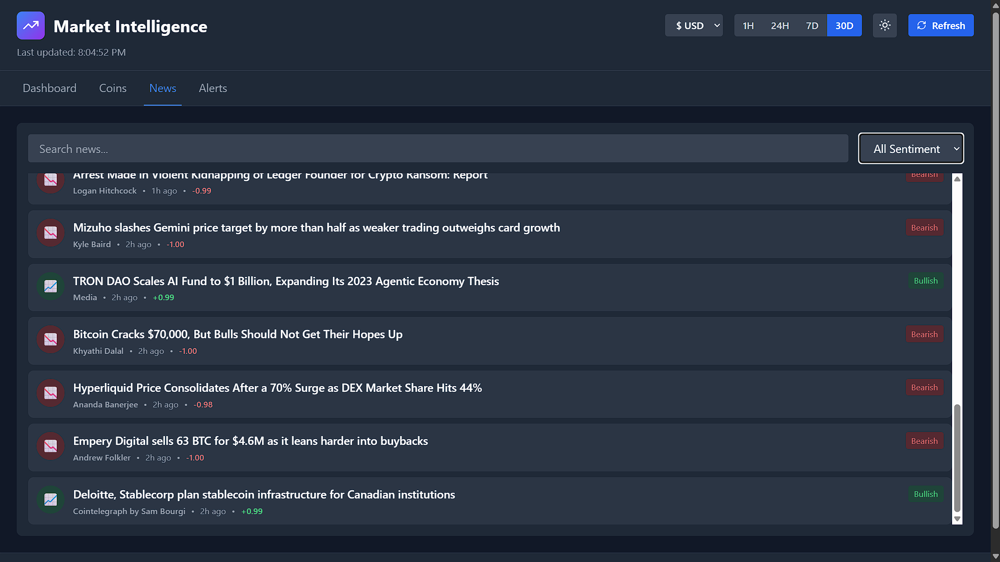
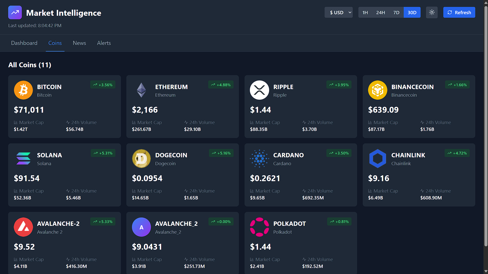
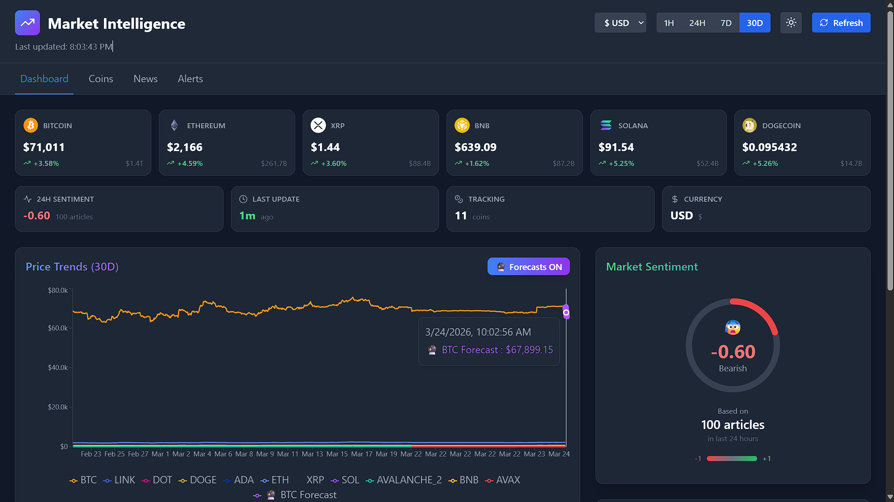
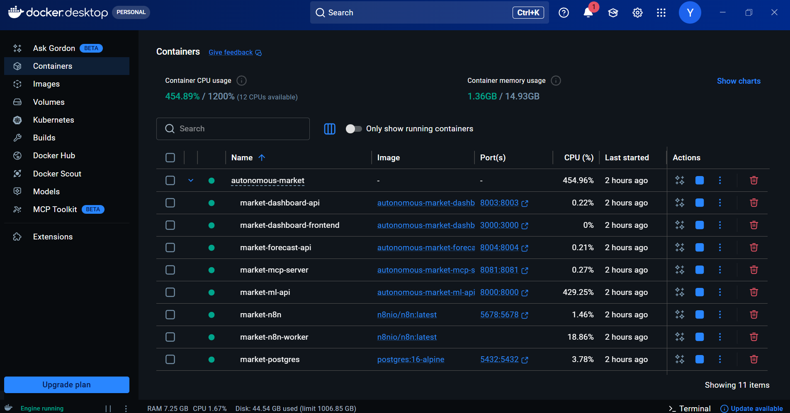
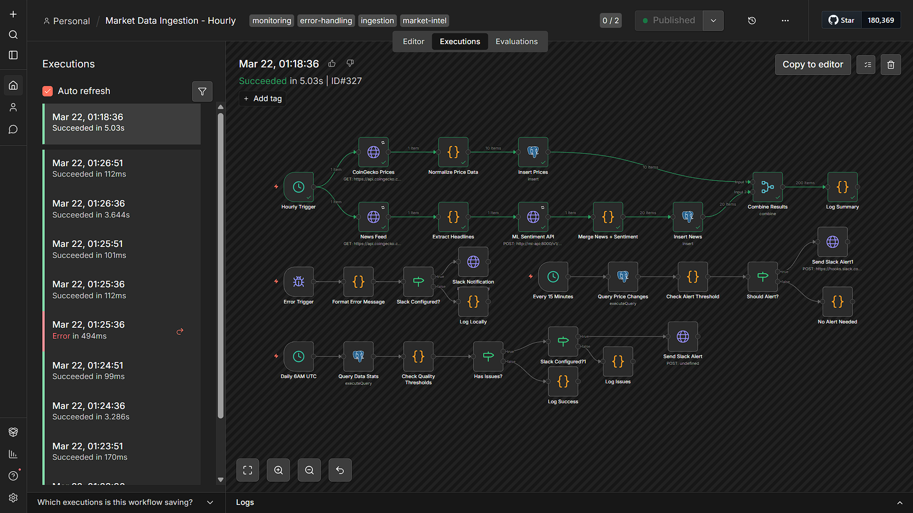
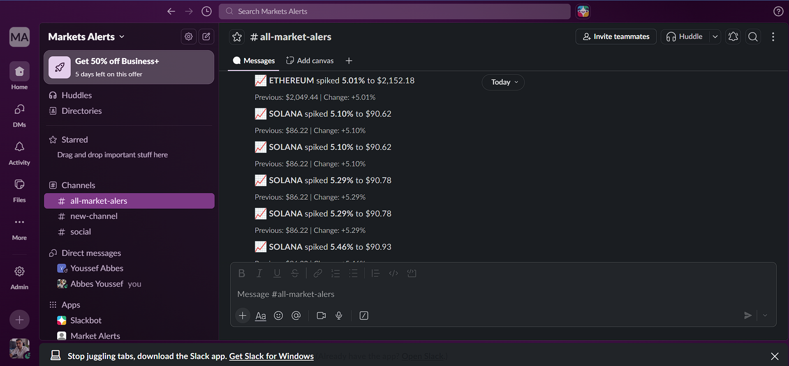
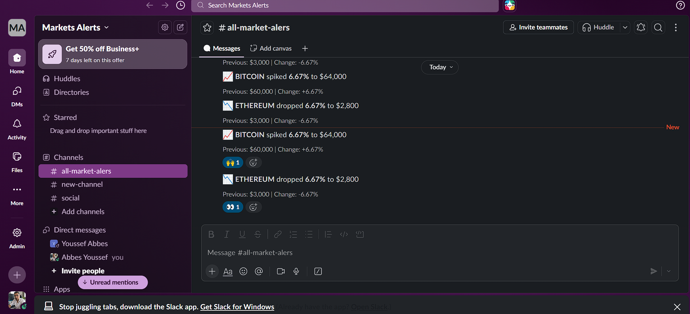
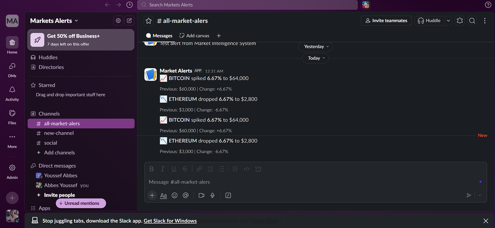
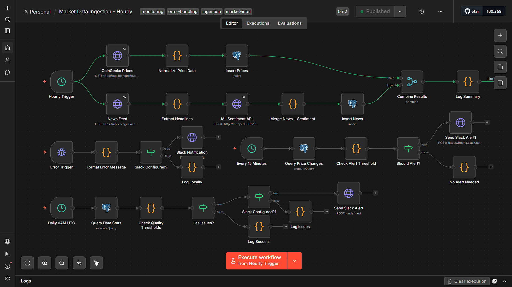

# Autonomous Market Intelligence

A full-stack cryptocurrency market intelligence platform with real-time data collection, ML-powered price forecasting, sentiment analysis, and a modern React dashboard.

## Features

- **Real-time Data Collection** - Automated price tracking for Bitcoin, Ethereum, Solana via CoinGecko API
- **ML Price Forecasting** - LightGBM model predicting 24h price direction with confidence levels
- **Sentiment Analysis** - NLP-powered news sentiment scoring using DistilBERT
- **Modern Dashboard** - React frontend with glassmorphism UI, multi-currency support
- **Workflow Automation** - n8n orchestration for data pipelines and alerts
- **MCP Server** - Model Context Protocol for AI assistant integration

## Architecture

```
                                    +------------------+
                                    |   Dashboard UI   |
                                    |   (React:3000)   |
                                    +--------+---------+
                                             |
              +------------------------------+------------------------------+
              |                              |                              |
    +---------v---------+         +----------v----------+         +---------v---------+
    |   Dashboard API   |         |    Forecast API     |         |      ML API       |
    |   (FastAPI:8003)  |         |   (FastAPI:8004)    |         |  (FastAPI:8000)   |
    +--------+----------+         +----------+----------+         +---------+---------+
             |                               |                              |
             |         +---------------------+                              |
             |         |                                                    |
    +--------v---------v----------------------------------------------------v---------+
    |                              PostgreSQL Database                                 |
    |                                   (:5432)                                        |
    +----------------------------------------------------------------------------------+
              ^                              ^
              |                              |
    +---------+---------+         +----------+----------+
    |        n8n        |         |     MCP Server      |
    |      (:5678)      |         |       (:8081)       |
    +-------------------+         +---------------------+
```

## Services

| Service | Port | Description |
|---------|------|-------------|
| **Dashboard Frontend** | 3000 | React UI with price charts, forecasts, news feed |
| **Dashboard API** | 8003 | Backend aggregation API for the dashboard |
| **Forecast API** | 8004 | ML prediction service with LightGBM model |
| **ML API** | 8000 | Sentiment analysis using DistilBERT |
| **MCP Server** | 8081 | Model Context Protocol for AI integrations |
| **n8n** | 5678 | Workflow automation and data pipelines |
| **PostgreSQL** | 5432 | Time-series data storage |
| **Redis** | 6379 | Queue backend for n8n workers |

## Quick Start

### Prerequisites

- Docker & Docker Compose
- Git

### Installation

1. **Clone the repository**
   ```bash
   git clone https://github.com/yourusername/autonomous-market.git
   cd autonomous-market
   ```

2. **Configure environment**
   ```bash
   # Linux/macOS
   cp .env.example .env

   # Windows PowerShell
   Copy-Item .env.example .env
   ```

3. **Edit `.env`** with your settings:
   ```env
   POSTGRES_PASSWORD=your-secure-password
   N8N_ENCRYPTION_KEY=your-random-secret
   N8N_BASIC_AUTH_PASSWORD=your-n8n-password
   ```

4. **Start all services**
   ```bash
   docker compose up --build -d
   ```

5. **Verify services are running**
   ```bash
   docker compose ps
   ```

### Access Points

| Service | URL |
|---------|-----|
| Dashboard | http://localhost:3000 |
| n8n Workflows | http://localhost:5678 |
| Forecast API Docs | http://localhost:8004/docs |
| ML API Docs | http://localhost:8000/docs |
| Dashboard API Docs | http://localhost:8003/docs |

## Dashboard

The dashboard provides a modern, responsive interface for monitoring cryptocurrency markets.

### Features

- **Price Charts** - Real-time price visualization with Recharts
- **ML Forecast Overlay** - Toggle to show 24h predictions (purple dashed line)
- **Multi-Currency** - Switch between USD, EUR, GBP, MAD
- **Sentiment Feed** - Latest news with AI sentiment scores
- **Dark/Light Mode** - Theme toggle
- **Glassmorphism UI** - Modern glass-effect cards with hover animations

### Screenshot







## ML Forecasting

The platform uses a **LightGBM gradient boosting classifier** trained on historical price data.

### Model Details

- **Algorithm**: LightGBM (Light Gradient Boosting Machine)
- **Task**: Binary classification (price up/down)
- **Features**: RSI, MACD, Bollinger Bands, price momentum, volatility
- **Training Data**: Historical hourly prices from CoinGecko
- **Accuracy**: ~53% on test data

### Prediction API

```bash
# Get 24-hour forecast for Bitcoin
curl -X POST "http://localhost:8004/predict/bitcoin?horizon_hours=24"
```

**Response:**
```json
{
  "symbol": "bitcoin",
  "predictions": [
    {
      "timestamp": "2024-03-23T19:00:00+00:00",
      "hour": 1,
      "direction": "up",
      "probability": 0.612,
      "price_estimate": 84750.25,
      "confidence_level": "medium"
    }
  ],
  "model_info": {
    "algorithm": "LightGBM",
    "accuracy": 0.533
  }
}
```

### Training Pipeline

The ML training pipeline is located in `services/ml_forecast/`:

```
services/ml_forecast/
├── phase2_cleaning.py      # Data preprocessing
├── phase3_training.py      # Feature engineering & model training
├── phase4_tuning.py        # Hyperparameter optimization
├── phase5_sentiment.py     # Sentiment feature integration
├── import_historical.py    # Historical price data import
└── import_historical_news.py # Historical news data import
```

## n8n Workflows

Automated data pipelines run via n8n:

| Workflow | Schedule | Description |
|----------|----------|-------------|
| **Fetch Prices** | Every 15 min | Collects prices from CoinGecko API |
| **Fetch News** | Every hour | Scrapes crypto news headlines |
| **Sentiment Analysis** | Every hour | Scores news with ML API |
| **Data Quality Check** | Daily 6 AM | Validates data freshness |
| **Stale Data Alert** | Daily | Slack notification if data is old |

### Setting Up Workflows

1. Access n8n at http://localhost:5678
2. Login with credentials from `.env`
3. Import workflows from `n8n/workflows/` (if provided)
4. Configure API credentials (CoinGecko, Slack webhooks)

### Workflow Screenshots





## Project Structure

```
autonomous-market/
├── docker-compose.yml          # All service definitions
├── .env.example                # Environment template
├── db/
│   └── init.sql                # Database schema
├── docs/
│   ├── n8n_strategy.md         # Workflow documentation
│   └── PHASE_2_ROADMAP.md      # Future features
├── services/
│   ├── dashboard/
│   │   ├── frontend/           # React + Vite + Tailwind
│   │   └── backend/            # FastAPI aggregation layer
│   ├── forecast_api/           # LightGBM prediction service
│   ├── ml_api/                 # Sentiment analysis service
│   ├── mcp_server/             # MCP protocol server
│   └── ml_forecast/            # Training scripts & notebooks
└── scripts/                    # Utility scripts
```

## Configuration

### Environment Variables

| Variable | Description | Default |
|----------|-------------|---------|
| `POSTGRES_DB` | Database name | `market_intel` |
| `POSTGRES_USER` | Database user | `market_user` |
| `POSTGRES_PASSWORD` | Database password | (required) |
| `N8N_ENCRYPTION_KEY` | n8n encryption secret | (required) |
| `N8N_BASIC_AUTH_USER` | n8n login username | `admin` |
| `N8N_BASIC_AUTH_PASSWORD` | n8n login password | (required) |
| `ML_API_MODEL_NAME` | HuggingFace model | `distilbert-base-uncased-finetuned-sst-2-english` |

### Adding More Cryptocurrencies

Update the `TRACKED_ASSETS` variable in n8n:

```
bitcoin,ethereum,solana,cardano,polkadot,avalanche-2
```

No code changes required - the system automatically tracks new assets.

## API Reference

### Dashboard API (port 8003)

| Endpoint | Method | Description |
|----------|--------|-------------|
| `/api/summary` | GET | Latest prices, sentiment, stats |
| `/api/prices/{symbol}` | GET | Price history for a symbol |
| `/api/news` | GET | Recent news with sentiment |
| `/api/forecast/{symbol}` | GET | ML predictions for symbol |

### Forecast API (port 8004)

| Endpoint | Method | Description |
|----------|--------|-------------|
| `/predict/{symbol}` | POST | Generate price predictions |
| `/model/info` | GET | Model metadata and accuracy |
| `/health` | GET | Service health check |

### ML API (port 8000)

| Endpoint | Method | Description |
|----------|--------|-------------|
| `/v1/sentiment/headlines` | POST | Analyze sentiment of text |
| `/health` | GET | Service health check |

## Development

### Running Locally (without Docker)

```bash
# Backend services
cd services/dashboard/backend
pip install -r requirements.txt
uvicorn main:app --port 8003

# Frontend
cd services/dashboard/frontend
npm install
npm run dev
```

### Rebuilding Services

```bash
# Rebuild specific service
docker compose build dashboard-frontend
docker compose up -d dashboard-frontend

# Rebuild all
docker compose up --build -d
```

### Viewing Logs

```bash
# All services
docker compose logs -f

# Specific service
docker compose logs -f forecast-api
```

### Infrastructure Snapshot



## Alerting Screenshots







## Roadmap

- [ ] ARIMA time-series model
- [ ] LSTM neural network predictions
- [ ] Price spike/drop alerts via Slack
- [ ] Portfolio tracking
- [ ] Backtesting system
- [ ] More cryptocurrency support
- [ ] Mobile-responsive dashboard

## Troubleshooting

### Services not starting

```bash
# Check logs
docker compose logs

# Restart all
docker compose down && docker compose up -d
```

### Database connection errors

Ensure PostgreSQL is healthy:
```bash
docker compose ps postgres
```

### Forecast not showing

1. Check forecast-api is running: `curl http://localhost:8004/health`
2. Ensure model is trained: `curl http://localhost:8004/model/info`
3. Check browser console for errors

## License

MIT License - see LICENSE file for details.

## Acknowledgments

- [CoinGecko API](https://www.coingecko.com/en/api) - Cryptocurrency data
- [LightGBM](https://lightgbm.readthedocs.io/) - ML framework
- [n8n](https://n8n.io/) - Workflow automation
- [Recharts](https://recharts.org/) - React charting library
